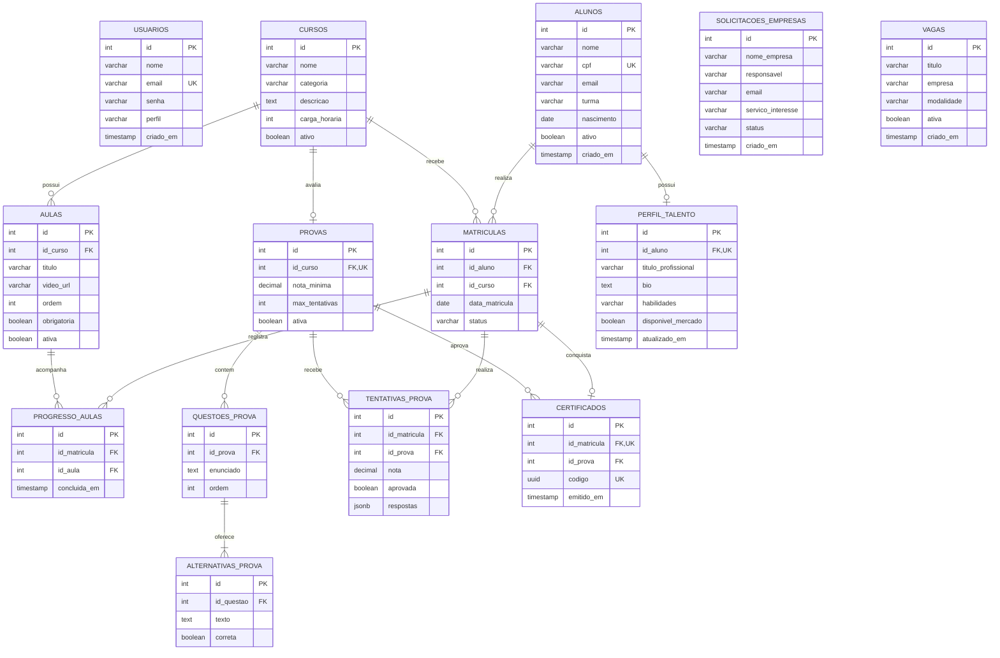
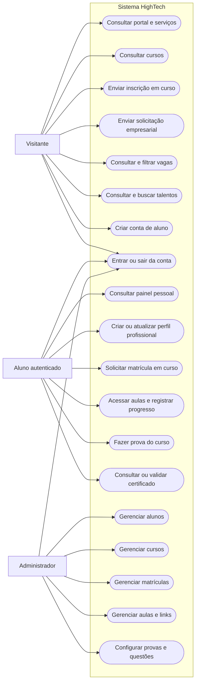
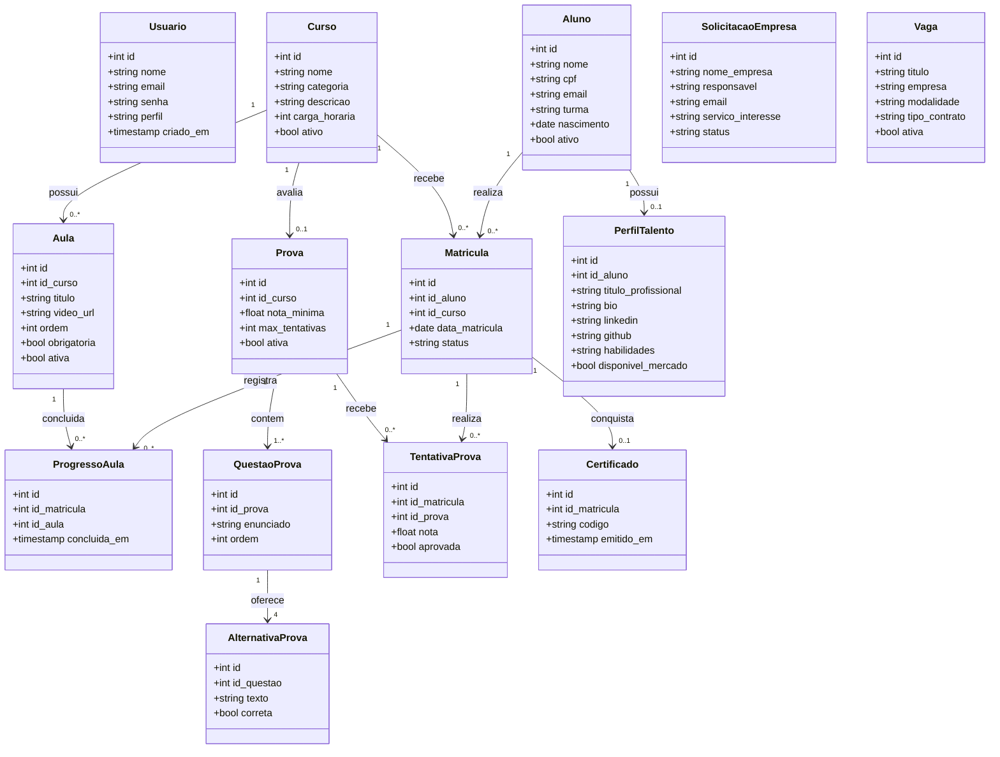
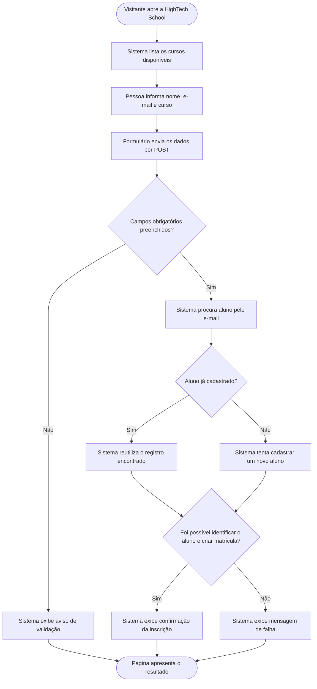

# HighTech — Sistema de serviços e educação em tecnologia

A **HighTech** é uma aplicação web acadêmica desenvolvida em PHP e PostgreSQL. O sistema combina um portal de serviços para empresas com a HighTech School, uma área de formação em tecnologia, e recursos para aproximar estudantes de oportunidades profissionais.

Por meio da aplicação, visitantes podem conhecer os serviços, consultar cursos e vagas, enviar solicitações corporativas e visualizar perfis profissionais públicos. Alunos podem criar uma conta, acompanhar matrículas, acessar as aulas dos cursos em que possuem matrícula ativa, registrar o progresso, fazer provas e receber certificados verificáveis após a aprovação. Administradores autenticados podem gerenciar alunos, cursos, matrículas, aulas e provas.

> Este documento descreve o comportamento e a estrutura presentes no projeto. Recursos mencionados como possibilidades futuras não devem ser considerados implementados.

---

## 📌 Sumário
- [Como executar o projeto localmente](#como-executar-o-projeto-localmente)
  - [Pré-requisitos](#pré-requisitos)
  - [Passo a passo de instalação](#passo-1-clonar-o-repositório)
  - [Como criar ou promover um Administrador](#passo-6-criar-uma-conta-e-acessar)
- [Especificação de Requisitos de Software (SRS)](#especificação-de-requisitos-de-software)
  - [1. Introdução](#1-introdução)
  - [2. Descrição global](#2-descrição-global)
  - [3. Requisitos do sistema](#3-requisitos-do-sistema)
    - [Requisitos Funcionais](#31-requisitos-funcionais)
    - [Requisitos Não Funcionais](#32-requisitos-não-funcionais)
    - [Regras de Negócio](#33-regras-de-negócio)
- [4. Estruturação do banco de dados](#4-estruturação-do-banco-de-dados)
- [5. Diagramas](#5-diagramas)
  - [Diagrama de Entidade-Relacionamento (DER)](#51-diagrama-de-entidade-relacionamento-der)
  - [Diagrama de Casos de Uso](#52-diagrama-de-casos-de-uso)
  - [Diagrama de Classes Conceitual](#53-diagrama-de-classes-conceitual)
  - [Diagrama de Fluxo de Inscrição](#54-diagrama-de-fluxo-de-inscrição-em-curso)

---

## Como executar o projeto localmente

Para executar a aplicação localmente, é necessário ter PHP e PostgreSQL instalados.

### Pré-requisitos

- **PHP 7.4 ou superior**, com as extensões `PDO`, `pdo_pgsql` e `mbstring` habilitadas.
- **PostgreSQL** instalado e em execução.
- **Git** instalado para clonar o repositório.
- O cliente de linha de comando `psql`, incluído na instalação do PostgreSQL.

### Passo 1: Clonar o repositório

Abra um terminal e execute:

```bash
# Clona o repositório do projeto.
git clone https://github.com/joaorbm09/HighTech.git

# Entra na pasta criada pelo Git.
cd HighTech
```

### Passo 2: Criar o banco de dados

Crie um banco de dados vazio para o projeto. O exemplo abaixo usa o usuário PostgreSQL `postgres`:

```bash
psql -U postgres -c "CREATE DATABASE hightech_school;"
```

Se o banco `hightech_school` já existir, escolha outro nome ou remova somente o banco local de desenvolvimento antes de recriá-lo. A remoção de um banco apaga os dados contidos nele.

### Passo 3: Criar as tabelas e carregar os dados de demonstração

Na raiz do repositório, execute o script SQL:

```bash
psql -U postgres -d hightech_school -f database/schema.sql
```

O arquivo `database/schema.sql` cria as tabelas, incluindo aulas, progresso, provas, questões, tentativas e certificados, e insere cursos, alunos, matrículas, vagas, uma solicitação corporativa e um perfil de talento de exemplo. O script não cria uma conta de usuário para login nem uma conta de administrador.

Em uma instalação existente, prefira aplicar somente a migração do fluxo educacional para não executar novamente os dados de demonstração:

```bash
psql -U postgres -d hightech_school -f database/migrations/20261002_learning_flow.sql
```

Esse comando pede ao PostgreSQL para conectar ao banco `hightech_school` como o usuário `postgres` e executar o arquivo SQL. Se o seu banco ou usuário tiver outro nome, troque esses valores pelo que você usa no pgAdmin.

#### Aplicar pelo pgAdmin

1. Abra o **pgAdmin** e conecte-se ao servidor PostgreSQL.
2. No navegador à esquerda, expanda **Servers → seu servidor → Databases** e clique uma vez no banco da aplicação (por exemplo, `hightech_school`). Confirme que selecionou o banco certo antes de executar qualquer script.
3. Clique com o botão direito nesse banco e escolha **Query Tool**.
4. No Query Tool, use **Open File** e selecione o arquivo `database/migrations/20261002_learning_flow.sql` dentro da pasta do projeto.
5. Confira que o Query Tool continua conectado ao banco da aplicação e pressione **F5** (ou clique no botão **Execute**).
6. O painel de mensagens deve indicar que os comandos `CREATE TABLE` foram executados. Esse arquivo só cria as tabelas novas — não apaga nem recarrega os dados de cursos, alunos ou matrículas.
7. Para confirmar, execute esta consulta no mesmo Query Tool:

```sql
SELECT table_name
FROM information_schema.tables
WHERE table_schema = 'public'
  AND table_name IN (
      'aulas',
      'progresso_aulas',
      'provas',
      'questoes_prova',
      'alternativas_prova',
      'tentativas_prova',
      'certificados'
  )
ORDER BY table_name;
```

O resultado deve listar as sete tabelas. Se uma tabela não aparecer, confira se o Query Tool estava no banco correto e se ele já tinha as tabelas `cursos` e `matriculas`.

Não é necessário executar `database/schema.sql` novamente em uma instalação existente: esse arquivo também insere dados de demonstração. A migração é a opção específica e mais segura para acrescentar o fluxo educacional ao banco que você já usa.

Administradores podem cadastrar e editar aulas em **Gestão de Aulas** no menu administrativo. Selecione o curso, informe o título, o link HTTP/HTTPS do material e a ordem. A descrição e as orientações complementares são opcionais. Use **Ocultar aula** para removê-la da área do aluno sem apagar o progresso registrado; ela pode ser publicada novamente depois. O aluno abre o link em uma nova aba e marca a aula como concluída na plataforma.

Em **Gestão de Provas**, configure a nota mínima e o número máximo de tentativas (o padrão inicial é 70% e 3 tentativas) e cadastre as questões de múltipla escolha, cada uma com quatro alternativas e uma resposta correta. Ative a prova depois de cadastrar as questões. Os alunos poderão fazê-la quando concluírem as aulas obrigatórias ativas. A aprovação emite um certificado único; o aluno pode imprimir a página ou salvá-la como PDF, e qualquer pessoa pode validar o código do certificado na mesma página.

Para os alunos, **Meu Painel** fica disponível no menu após o login. Uma matrícula ativa libera somente as aulas publicadas para aquele curso; se a lista mostrar **Aulas ainda não publicadas**, o administrador precisa cadastrar e ativar os materiais em **Gestão de Aulas**. A seção **Matrícula Express** permite escolher cursos ativos em que o aluno ainda não esteja matriculado.

O fluxo de prova atual é corrigido pela própria HighTech School para que a nota e a emissão do certificado sejam verificadas no servidor. Um link simples para Google Forms não transmite uma nota confiável à plataforma; a integração automática com um formulário externo exige uma conexão autenticada com Google Forms/Apps Script e configuração adicional.

Os links são hospedados pelo serviço que você escolher (por exemplo, vídeo ou armazenamento externo); a HighTech School controla quem vê o link dentro do curso, mas o controle de compartilhamento do próprio arquivo também deve ser configurado nesse serviço.

Também é possível inserir uma aula diretamente no banco. O exemplo abaixo adiciona uma aula demonstrativa ao curso indicado, sem duplicá-la se a ordem já estiver ocupada:

```sql
INSERT INTO aulas (id_curso, titulo, descricao, conteudo, ordem)
SELECT id, 'Introdução', 'Apresentação do curso e dos objetivos.',
       'Leia o material de introdução e anote os principais objetivos de aprendizagem.', 1
FROM cursos
WHERE nome = 'Desenvolvimento Web & PHP'
ON CONFLICT (id_curso, ordem) DO NOTHING;
```

### Passo 4: Configurar a conexão PHP

A aplicação lê as configurações em `database/connect.php`. Você pode definir variáveis de ambiente no seu sistema ou ajustar diretamente as variáveis no arquivo:

- `DB_HOST`: Endereço do servidor PostgreSQL (padrão: `192.168.10.52` ou `localhost`).
- `DB_PORT`: Porta do servidor (padrão: `5432`).
- `DB_NAME`: Nome da base de dados (padrão: `hightech_school`).
- `DB_USER`: Usuário do banco (padrão: `admin` ou `postgres`).
- `DB_PASS`: Senha do usuário do banco.

Confirme que os módulos necessários estão habilitados:

```bash
php -m
```

Na lista apresentada, verifique a presença de `PDO`, `pdo_pgsql` e `mbstring`.

### Passo 5: Iniciar a aplicação

Na raiz do projeto, inicie o servidor embutido do PHP:

```bash
php -S localhost:8000
```

Abra o endereço abaixo no navegador:

```text
http://localhost:8000
```

O `index.php` redireciona para `portal_empresa.php`.

### Passo 6: Criar uma conta e acessar

1. Acesse `http://localhost:8000/login/cadastrar.php` e use a opção **Cadastrar-se** para criar uma conta de aluno. O formulário cria a conta de usuário e o registro acadêmico correspondente.
2. Por padrão, todas as contas criadas pelo formulário público recebem o perfil `aluno`.
3. **Para promover um usuário a Administrador**, execute no pgAdmin ou psql:

```sql
UPDATE usuarios SET perfil = 'admin' WHERE email = 'seu_email@exemplo.com';
```

Com o perfil `admin`, novos menus de gestão serão liberados no cabeçalho: **Gestão Alunos**, **Gestão Cursos**, **Gestão de Aulas**, **Gestão de Provas** e **Matrículas**.

---

## Especificação de requisitos de software

Especificação de Requisitos de Software (SRS), organizada como referência à estrutura da ISO/IEC/IEEE 29148:2018.

## 1. Introdução

#### 1.1 Escopo do sistema

Este documento descreve a aplicação **HighTech**, que reúne serviços de tecnologia para empresas e funcionalidades educacionais voltadas a alunos da HighTech School. A aplicação disponibiliza páginas públicas, autenticação de alunos e administradores, gestão de registros acadêmicos, divulgação de vagas e perfis profissionais, além do recebimento de solicitações corporativas.

O sistema é implementado em PHP, utiliza PostgreSQL para persistência e acessa o banco por meio de PDO. O escopo documentado corresponde às páginas, operações e tabelas presentes neste repositório.

#### 1.2 Propósito

O propósito do sistema é centralizar operações acadêmicas básicas, apresentar os serviços da empresa e conectar estudantes a oportunidades de tecnologia. A aplicação também serve como projeto de aprendizagem sobre desenvolvimento web, sessões, operações CRUD, relacionamento entre tabelas e integração PHP/PostgreSQL.

---

## 2. Descrição global

#### 2.1 Prototipagem

O repositório não contém um link de prototipagem ou especificação visual externa. A interface atual é implementada nas páginas PHP e estilizada pelo arquivo `assets/style.css`.

#### 2.2 Funções do sistema

O sistema oferece as seguintes funções principais:

1. Apresentar os serviços corporativos e receber solicitações de diagnóstico tecnológico.
2. Exibir cursos e permitir que visitantes enviem uma inscrição associada a um curso.
3. Cadastrar alunos como usuários e autenticar contas existentes.
4. Controlar o acesso às páginas administrativas de alunos, cursos e matrículas.
5. Permitir que administradores cadastrem, consultem, editem e excluam alunos e cursos.
6. Permitir que administradores criem e cancelem matrículas entre alunos e cursos.
7. Disponibilizar ao aluno um painel com seus cursos e dados do perfil profissional.
8. Permitir que administradores cadastrem, editem, ordenem, publiquem e ocultem aulas com links externos.
9. Permitir que alunos com matrícula ativa acessem os links das aulas e registrem sua conclusão.
10. Exibir no painel o progresso real das aulas de cada curso.
11. Permitir que administradores configurem provas e cadastrem questões de múltipla escolha.
12. Liberar a prova após a conclusão das aulas obrigatórias e registrar cada tentativa e nota.
13. Emitir certificado automaticamente após aprovação e permitir a consulta pública de sua validade.
14. Permitir que o aluno salve ou atualize um perfil de talento e faça matrícula rápida em outro curso.
15. Exibir perfis públicos de talentos disponíveis e permitir busca por nome, título ou habilidades.
16. Exibir vagas ativas e filtrar a listagem por modalidade de trabalho.
17. Encerrar a sessão do usuário e redirecioná-lo ao portal público.

#### 2.3 Classes de usuários

| Usuário | Descrição e permissões |
| --- | --- |
| **Visitante** | Pode consultar páginas públicas, cursos, vagas e perfis públicos; também pode enviar solicitações empresariais e inscrições em cursos. |
| **Aluno** | Pode autenticar, acessar o próprio painel, consultar suas matrículas, estudar aulas de cursos em que está matriculado, registrar o progresso, fazer provas liberadas, consultar certificados e salvar seu perfil profissional. |
| **Administrador** | Pode acessar as telas administrativas de alunos, cursos, matrículas, aulas e provas, além das funções disponíveis ao usuário autenticado. |

O cadastro público cria contas com o perfil `aluno`. O perfil `admin` precisa ser atribuído por um processo administrativo; o esquema SQL não cria uma conta administrativa.

---

## 3. Requisitos do sistema

### 3.1 Requisitos funcionais

#### Módulo de acesso e autenticação

| ID | Título | Descrição | Prioridade |
| --- | --- | --- | --- |
| **RF01** | Cadastro de aluno | O sistema deve permitir que um visitante crie uma conta de aluno informando nome, e-mail e senha. | Alta |
| **RF02** | Validação de cadastro | O sistema deve verificar o preenchimento dos campos obrigatórios, a confirmação da senha, o tamanho mínimo de seis caracteres e a existência prévia do e-mail. | Alta |
| **RF03** | Autenticação | O sistema deve permitir que o usuário entre com e-mail e senha válidos. | Alta |
| **RF04** | Controle de acesso | O sistema deve exigir autenticação para o painel do aluno e autenticação com perfil `admin` para as páginas administrativas. | Alta |
| **RF05** | Encerramento da sessão | O sistema deve permitir que o usuário encerre a sessão e seja redirecionado ao portal. | Média |

#### Módulo institucional e de solicitações empresariais

| ID | Título | Descrição | Prioridade |
| --- | --- | --- | --- |
| **RF06** | Apresentação dos serviços | O sistema deve apresentar informações sobre os serviços corporativos e a HighTech School. | Média |
| **RF07** | Solicitação de diagnóstico | O sistema deve permitir que uma empresa envie seus dados de contato, serviço de interesse e uma mensagem opcional. | Alta |
| **RF08** | Retorno do envio | O sistema deve informar se a solicitação corporativa foi registrada ou se ocorreu uma falha. | Média |

#### Módulo de cursos, alunos e matrículas

| ID | Título | Descrição | Prioridade |
| --- | --- | --- | --- |
| **RF09** | Consulta de cursos | O sistema deve exibir os cursos cadastrados com categoria, descrição e carga horária. | Alta |
| **RF10** | Inscrição pública | O sistema deve permitir que uma pessoa informe seus dados e selecione um curso para criar ou reutilizar um registro de aluno e solicitar matrícula. | Alta |
| **RF11** | Gestão de alunos | O sistema deve permitir que administradores consultem, cadastrem, editem e excluam alunos. | Alta |
| **RF12** | Gestão de cursos | O sistema deve permitir que administradores consultem, cadastrem, editem e excluam cursos. | Alta |
| **RF13** | Gestão de matrículas | O sistema deve permitir que administradores criem matrículas, consultem a listagem combinada de alunos e cursos e cancelem matrículas. | Alta |
| **RF14** | Painel individual do aluno | O sistema deve permitir que um aluno autenticado consulte seus cursos e a carga horária total exibida no painel. | Média |
| **RF15** | Perfil profissional | O sistema deve permitir que o aluno crie ou atualize seu título profissional, biografia, links, habilidades e disponibilidade pública. | Média |
| **RF16** | Matrícula rápida | O painel do aluno deve permitir o envio de solicitação de matrícula em outro curso. | Média |

#### Módulo de talentos e oportunidades

| ID | Título | Descrição | Prioridade |
| --- | --- | --- | --- |
| **RF17** | Vitrine de talentos | O sistema deve exibir perfis marcados como disponíveis de alunos ativos. | Média |
| **RF18** | Busca de talentos | O sistema deve permitir filtrar a vitrine por nome, título profissional ou habilidades. | Média |
| **RF19** | Mural de vagas | O sistema deve listar vagas ativas com informações de empresa, modalidade, contrato e candidatura. | Média |
| **RF20** | Filtro de vagas | O sistema deve permitir filtrar as vagas por modalidade de trabalho. | Média |

#### Módulo de aulas, avaliações e certificação

| ID | Título | Descrição | Prioridade |
| --- | --- | --- | --- |
| **RF21** | Acesso às aulas | O sistema deve liberar o conteúdo de um curso somente para aluno autenticado com matrícula ativa nesse curso. | Alta |
| **RF22** | Registro de progresso | O sistema deve permitir que o aluno marque como concluída uma aula ativa do curso em que está matriculado e exibir seu progresso no painel. | Alta |
| **RF23** | Gestão de aulas | O sistema deve permitir que administradores cadastrem, editem, ordenem, publiquem e ocultem aulas e seus links de material por curso. | Alta |
| **RF24** | Gestão de prova | O sistema deve permitir que administradores configurem a nota mínima, o limite de tentativas, o estado da prova e questões de múltipla escolha por curso. | Alta |
| **RF25** | Realização de prova | O sistema deve liberar a prova a alunos com matrícula ativa após a conclusão das aulas obrigatórias, corrigir as respostas no servidor e registrar a nota. | Alta |
| **RF26** | Certificado verificável | O sistema deve emitir um código único após aprovação e permitir visualizar, imprimir e validar publicamente o certificado. | Alta |

### 3.2 Requisitos não funcionais

#### Módulo de ambiente e arquitetura

| ID | Título | Descrição | Prioridade |
| --- | --- | --- | --- |
| **RNF01** | Tecnologias de execução | A aplicação deve executar em PHP 7.4 ou superior com PDO, `pdo_pgsql` e `mbstring`, e utilizar PostgreSQL como banco de dados. | Alta |
| **RNF02** | Separação de responsabilidades | A conexão, autenticação, funções de dados, páginas e estilos devem permanecer organizados nos arquivos e diretórios próprios do projeto. | Média |
| **RNF03** | Compatibilidade web | As páginas devem ser acessíveis por navegadores web modernos sem instalação de um cliente específico. | Média |

#### Módulo de segurança e integridade

| ID | Título | Descrição | Prioridade |
| --- | --- | --- | --- |
| **RNF04** | Acesso ao banco | Os valores fornecidos pelo usuário em operações SQL devem ser enviados por parâmetros PDO em vez de concatenados às consultas. | Alta |
| **RNF05** | Proteção de senhas | As senhas de usuários devem ser armazenadas por meio de hash e verificadas sem salvar senha em texto simples. | Alta |
| **RNF06** | Proteção de páginas | As páginas administrativas e o painel individual devem validar a sessão e o perfil antes de apresentar os dados. | Alta |
| **RNF07** | Saída HTML | Os valores de dados dinâmicos apresentados em HTML devem ser escapados para reduzir a possibilidade de injeção de marcação ou script. | Alta |
| **RNF08** | Integridade referencial | As relações entre alunos, cursos, matrículas e perfis devem ser protegidas por chaves estrangeiras no banco de dados. | Alta |
| **RNF09** | Configuração de credenciais | Credenciais de conexão devem ser substituídas pelos valores do ambiente local e não devem ser publicadas como segredos de produção. | Alta |

#### Módulo de usabilidade e apresentação

| ID | Título | Descrição | Prioridade |
| --- | --- | --- | --- |
| **RNF10** | Interface consistente | As páginas devem reutilizar os estilos globais e os componentes compartilhados de cabeçalho e rodapé. | Média |
| **RNF11** | Layout adaptável | Grades e formulários devem se reorganizar de acordo com o espaço disponível na tela. | Média |
| **RNF12** | Feedback de operações | O sistema deve apresentar mensagens de sucesso, erro ou validação para operações de formulários. | Média |

### 3.3 Regras de negócio

#### Módulo de contas e permissões

| ID | Título | Regra / condição |
| --- | --- | --- |
| **RN01** | Perfil inicial de cadastro | Contas criadas pelo formulário público recebem o perfil `aluno`. |
| **RN02** | Acesso administrativo | Somente uma sessão autenticada cujo perfil seja `admin` pode acessar as páginas administrativas de alunos, cursos, matrículas, aulas e provas. |
| **RN03** | Acesso ao painel do aluno | O painel individual exige uma sessão autenticada. |
| **RN04** | Senha de conta | O cadastro rejeita senhas com menos de seis caracteres e exige que a confirmação corresponda à senha. |

#### Módulo acadêmico

| ID | Título | Regra / condição |
| --- | --- | --- |
| **RN05** | Campos obrigatórios de aluno | Nome e e-mail são obrigatórios nas operações administrativas de cadastro e atualização de aluno. |
| **RN06** | Campos obrigatórios de curso | Nome, categoria e carga horária maior que zero são necessários para salvar um curso pela tela administrativa. |
| **RN07** | Relação de matrícula | Cada matrícula referencia um aluno e um curso existentes. |
| **RN08** | Exclusão em cascata | A exclusão de aluno ou curso remove do banco os registros de matrícula associados; a exclusão de aluno também remove seu perfil de talento. |
| **RN09** | Perfil de talento por aluno | Cada aluno pode ter no máximo um perfil de talento, conforme a restrição única de `perfil_talento.id_aluno`. |
| **RN10** | Visibilidade de talentos | A vitrine pública inclui apenas perfis com `disponivel_mercado = true` pertencentes a alunos ativos. |
| **RN15** | Liberação da prova | A prova ativa só pode ser realizada com matrícula ativa e após concluir todas as aulas obrigatórias que estejam publicadas. |
| **RN16** | Aprovação | A nota da prova é calculada no servidor e deve atingir ou superar a nota mínima configurada para o curso. |
| **RN17** | Limite de tentativas | A prova impede novas tentativas depois de atingir o limite configurado, entre 1 e 20 tentativas. |
| **RN18** | Emissão única | Cada matrícula aprovada recebe um único certificado com código aleatório para validação pública. |

#### Módulo corporativo e de oportunidades

| ID | Título | Regra / condição |
| --- | --- | --- |
| **RN11** | Solicitação empresarial | Empresa, responsável, e-mail e serviço de interesse são obrigatórios no formulário do portal; a nova solicitação recebe status `Pendente`. |
| **RN12** | Exibição de vagas | A listagem pública apresenta somente vagas ativas por padrão. |
| **RN13** | Candidatura | O contato de candidatura pode ser exibido como endereço de e-mail ou como link fornecido no cadastro da vaga. |
| **RN14** | CPF opcional e único quando informado | O CPF pode ficar vazio; quando informado, o índice parcial impede repetições entre valores não nulos. |

---

## 4. Estruturação do banco de dados

O banco PostgreSQL utiliza quatorze tabelas. Os campos e as regras abaixo correspondem ao arquivo `database/schema.sql`.

#### Entidade: `usuarios` (contas de acesso)

Armazena as credenciais e o perfil de acesso de cada usuário.

| Campo | Tipo | Restrições | Descrição |
| --- | --- | --- | --- |
| `id` | SERIAL | PRIMARY KEY | Identificador da conta. |
| `nome` | VARCHAR(100) | NOT NULL | Nome exibido nas páginas autenticadas. |
| `email` | VARCHAR(100) | UNIQUE, NOT NULL | Endereço usado no login; não pode se repetir. |
| `senha` | VARCHAR(255) | NOT NULL | Hash de senha gerado pela aplicação. |
| `perfil` | VARCHAR(20) | DEFAULT 'aluno' | Perfil de acesso, por exemplo `aluno` ou `admin`. |
| `criado_em` | TIMESTAMP | DEFAULT CURRENT_TIMESTAMP | Data e hora de criação da conta. |

#### Entidade: `alunos` (cadastro acadêmico)

Armazena os dados acadêmicos e de contato do aluno. O cadastro acadêmico é separado da conta de autenticação.

| Campo | Tipo | Restrições | Descrição |
| --- | --- | --- | --- |
| `id` | SERIAL | PRIMARY KEY | Identificador do aluno. |
| `nome` | VARCHAR(100) | NOT NULL | Nome completo. |
| `cpf` | VARCHAR(14) | Opcional; índice único parcial | Documento opcional; valores não nulos não podem se repetir. |
| `email` | VARCHAR(100) | NOT NULL | E-mail de contato e associação com a conta. |
| `turma` | VARCHAR(20) | Opcional | Turma ou grupo acadêmico. |
| `nascimento` | DATE | Opcional | Data de nascimento. |
| `ativo` | BOOLEAN | DEFAULT true | Indica se o aluno está ativo. |
| `criado_em` | TIMESTAMP | DEFAULT CURRENT_TIMESTAMP | Data e hora de criação do registro. |

#### Entidade: `cursos` (catálogo da escola)

Armazena os cursos oferecidos pela HighTech School.

| Campo | Tipo | Restrições | Descrição |
| --- | --- | --- | --- |
| `id` | SERIAL | PRIMARY KEY | Identificador do curso. |
| `nome` | VARCHAR(100) | NOT NULL | Nome do curso. |
| `categoria` | VARCHAR(50) | NOT NULL | Área ou categoria do curso. |
| `descricao` | TEXT | Opcional | Descrição do conteúdo. |
| `carga_horaria` | INT | NOT NULL | Duração do curso em horas. |
| `ativo` | BOOLEAN | DEFAULT true | Indica se o curso está ativo. |

#### Entidade: `matriculas` (relação entre alunos e cursos)

Implementa a associação muitos-para-muitos entre alunos e cursos.

| Campo | Tipo | Restrições | Descrição |
| --- | --- | --- | --- |
| `id` | SERIAL | PRIMARY KEY | Identificador da matrícula. |
| `id_aluno` | INT | NOT NULL, FOREIGN KEY | Referência a `alunos.id`; removida em cascata com o aluno. |
| `id_curso` | INT | NOT NULL, FOREIGN KEY | Referência a `cursos.id`; removida em cascata com o curso. |
| `data_matricula` | DATE | DEFAULT CURRENT_DATE | Data da matrícula. |
| `status` | VARCHAR(20) | DEFAULT 'Ativa' | Situação da matrícula, como ativa, concluída ou trancada. |

#### Entidade: `aulas` e `progresso_aulas`

`aulas` armazena os materiais publicados em cada curso. `progresso_aulas` registra a conclusão por matrícula e impede duplicar o registro da mesma aula.

| Tabela | Campo | Tipo | Restrições | Descrição |
| --- | --- | --- | --- | --- |
| `aulas` | `id` | SERIAL | PRIMARY KEY | Identificador da aula. |
| `aulas` | `id_curso` | INT | NOT NULL, FOREIGN KEY | Curso ao qual a aula pertence; remoção em cascata. |
| `aulas` | `titulo` | VARCHAR(150) | NOT NULL | Título exibido ao aluno. |
| `aulas` | `descricao`, `conteudo` | TEXT | Opcional | Descrição e material textual da aula. |
| `aulas` | `video_url` | VARCHAR(500) | Opcional | Endereço externo do material em vídeo. |
| `aulas` | `ordem` | INT | NOT NULL, UNIQUE por curso | Posição da aula na sequência do curso. |
| `aulas` | `obrigatoria`, `ativa` | BOOLEAN | DEFAULT true | Indica se a aula é obrigatória e se está publicada. |
| `progresso_aulas` | `id_matricula`, `id_aula` | INT | FOREIGN KEY, UNIQUE em conjunto | Associa a conclusão à matrícula e à aula. |
| `progresso_aulas` | `concluida_em` | TIMESTAMP | DEFAULT CURRENT_TIMESTAMP | Data e hora em que o aluno marcou a aula como concluída. |

#### Entidades de provas, questões e certificados

Cada curso pode ter uma prova, composta por questões de múltipla escolha com quatro alternativas. A tentativa registra nota e respostas; a aprovação gera um certificado com código UUID único.

| Tabela | Campos principais | Regras |
| --- | --- | --- |
| `provas` | `id`, `id_curso`, `nota_minima`, `max_tentativas`, `ativa` | Uma prova por curso; nota de 1 a 100 e limite de 1 a 20 tentativas. |
| `questoes_prova` | `id`, `id_prova`, `enunciado`, `ordem` | Questões pertencentes à prova; ordem única dentro da avaliação. |
| `alternativas_prova` | `id`, `id_questao`, `texto`, `correta` | Quatro alternativas por questão, com somente uma resposta correta definida pela gestão. |
| `tentativas_prova` | `id`, `id_matricula`, `id_prova`, `nota`, `aprovada`, `respostas`, `realizada_em` | Guarda o resultado calculado no servidor e as respostas submetidas em JSONB. |
| `certificados` | `id`, `id_matricula`, `id_prova`, `codigo`, `emitido_em` | No máximo um certificado por matrícula; código UUID único usado para validação pública. |

#### Entidade: `solicitacoes_empresas` (contatos corporativos)

Registra os pedidos de diagnóstico tecnológico enviados pelo portal da empresa.

| Campo | Tipo | Restrições | Descrição |
| --- | --- | --- | --- |
| `id` | SERIAL | PRIMARY KEY | Identificador da solicitação. |
| `nome_empresa` | VARCHAR(150) | NOT NULL | Nome da empresa ou organização. |
| `cnpj` | VARCHAR(20) | Opcional | CNPJ informado pela empresa. |
| `responsavel` | VARCHAR(100) | NOT NULL | Pessoa de contato. |
| `email` | VARCHAR(100) | NOT NULL | E-mail para retorno. |
| `telefone` | VARCHAR(25) | Opcional | Telefone ou WhatsApp. |
| `tamanho_equipe` | VARCHAR(50) | Opcional | Faixa de tamanho da organização. |
| `servico_interesse` | VARCHAR(100) | NOT NULL | Serviço sobre o qual a empresa quer conversar. |
| `mensagem` | TEXT | Opcional | Contexto ou descrição do desafio. |
| `status` | VARCHAR(30) | DEFAULT 'Pendente' | Situação da solicitação. |
| `criado_em` | TIMESTAMP | DEFAULT CURRENT_TIMESTAMP | Data e hora do envio. |

#### Entidade: `vagas` (oportunidades profissionais)

Armazena as oportunidades exibidas no mural público.

| Campo | Tipo | Restrições | Descrição |
| --- | --- | --- | --- |
| `id` | SERIAL | PRIMARY KEY | Identificador da vaga. |
| `titulo` | VARCHAR(150) | NOT NULL | Cargo ou título da oportunidade. |
| `empresa` | VARCHAR(150) | NOT NULL | Empresa contratante. |
| `modalidade` | VARCHAR(50) | DEFAULT 'Remoto' | Modalidade, por exemplo remoto, híbrido ou presencial. |
| `tipo_contrato` | VARCHAR(50) | DEFAULT 'CLT' | Tipo de vínculo, por exemplo CLT, PJ ou estágio. |
| `localizacao` | VARCHAR(100) | DEFAULT 'Brasil' | Cidade ou abrangência geográfica. |
| `salario` | VARCHAR(50) | Opcional | Faixa salarial em formato textual. |
| `descricao` | TEXT | NOT NULL | Descrição da oportunidade. |
| `requisitos` | TEXT | Opcional | Requisitos e conhecimentos desejados. |
| `contato_candidatura` | VARCHAR(255) | Opcional | E-mail ou endereço para candidatura. |
| `ativa` | BOOLEAN | DEFAULT true | Controla se a vaga aparece na listagem pública. |
| `criado_em` | TIMESTAMP | DEFAULT CURRENT_TIMESTAMP | Data e hora de criação. |

#### Entidade: `perfil_talento` (perfil profissional)

Armazena dados profissionais opcionais associados a um aluno.

| Campo | Tipo | Restrições | Descrição |
| --- | --- | --- | --- |
| `id` | SERIAL | PRIMARY KEY | Identificador do perfil. |
| `id_aluno` | INT | NOT NULL, FOREIGN KEY, UNIQUE | Referência única a `alunos.id`; perfil removido em cascata com o aluno. |
| `titulo_profissional` | VARCHAR(100) | Opcional | Cargo ou especialidade. |
| `bio` | TEXT | Opcional | Resumo profissional. |
| `linkedin` | VARCHAR(255) | Opcional | Link para o LinkedIn. |
| `github` | VARCHAR(255) | Opcional | Link para GitHub ou portfólio. |
| `habilidades` | VARCHAR(255) | Opcional | Habilidades, normalmente separadas por vírgulas. |
| `disponivel_mercado` | BOOLEAN | DEFAULT true | Controla se o perfil pode ser exibido na vitrine. |
| `atualizado_em` | TIMESTAMP | DEFAULT CURRENT_TIMESTAMP | Data e hora da última atualização registrada. |

---

## 5. Diagramas

### 5.1 Diagrama de entidade-relacionamento (DER)

O diagrama representa as tabelas e os relacionamentos definidos no esquema PostgreSQL.



`USUARIOS` e `ALUNOS` são tabelas distintas e não possuem uma chave estrangeira entre si no esquema atual; as páginas associam os registros pelo e-mail.

### 5.2 Diagrama de casos de uso

O diagrama resume as ações disponíveis para visitantes, alunos e administradores. A autorização das telas administrativas é verificada no servidor.



### 5.3 Diagrama de classes conceitual

O diagrama apresenta uma visão conceitual das entidades persistidas e das associações existentes. Ele não representa classes PHP: o projeto implementa as operações como funções e páginas.



### 5.4 Diagrama de fluxo de inscrição em curso

O fluxo abaixo representa, em alto nível, o envio público de inscrição tratado por `aplicacao.php`.


